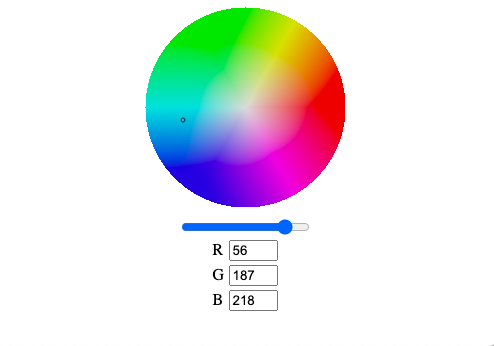

# Simple color picker

This is the module to pick a color for user. I use hsv color model to 
represent color picking region. I did not have lot of controls for this module.
If you want to have more controls, You need create some controls by yourself.
I am going to this module for another my project. When I use this module on 
an app project, I will create some suitable custom color input controls for the app.

